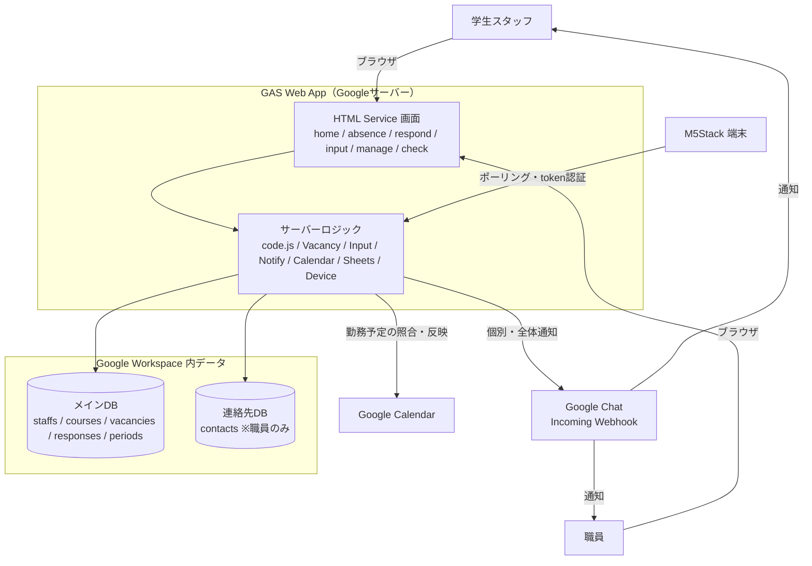

# ryukoku-support-shift

> 龍谷大学 障がい学生支援室の **シフト管理・欠員補充・勤怠チェック** を自動化する Web システム

ノートテイカー（学生スタッフ）のシフトを時間割としてアプリ内に常設し、欠員が出たら
候補を自動抽出 → Chat で代行依頼 → **最初に承諾した人へ先着で自動確定**するところまでを一気通貫で行う。

| | |
|---|---|
| **技術** | Google Apps Script ＋ HTML Service ＋ Spreadsheet ＋ Google Chat Webhook |
| **データ** | すべて大学 Google Workspace 内に完結（外部DB・外部サービスへ個人情報を出さない） |
| **対象期限** | 2026-09-17（授業開始日） |

---

## 🎯 解決する2つの課題

1. **欠員補充の非効率** — 欠勤連絡が通知に埋もれ、職員が空きスタッフを目視で探して個別電話していた
   → **欠員をPush通知し、候補を自動抽出して先着で自動確定**
2. **勤怠照合の手作業** — カレンダーの勤務予定と勤怠登録を職員が目視で突き合わせていた
   → **自動照合して差分をハイライト**（機能B・開発中）

---

## 🏗 アーキテクチャ



> 📐 画面ごとのデータフロー・通知シーケンス・権限設計など**詳細は [`docs/architecture.md`](docs/architecture.md)** を参照。

---

## 🖥 画面一覧

| 画面 | URL | 対象 | 概要 |
|---|---|---|---|
| シフト確認（時間割） | `?page=home` | 全員 | 利用者中心の時間割。空き枠の可視化・マイビュー |
| 欠勤連絡 | `?page=absence` | 全員 | 欠勤登録 → 候補抽出 → Chat通知 |
| 代行依頼への回答 | `?page=respond` | 候補者 | 承諾／辞退。先着で自動確定 |
| シフト入力 | `?page=input` | 職員 | 時間割（courses）の追加・削除 |
| 欠員補充管理 | `?page=manage` | 職員 | 欠員一覧・回答状況の確認 |
| 整合性チェック | `?page=check` | 職員 | 勤怠照合（**開発中**） |
| 端末エンドポイント | `?device=alert` | M5Stack | 未対応欠員の件数のみ返す（個人情報なし） |

---

## ✨ 実装済みの機能

<details open>
<summary><b>シフト確認（時間割）</b> — 「どこのシフトが空いているか」をひと目で</summary>

- 利用者（被支援者）中心の時間割をアプリ内にデジタル表示（D8）
- **レスポンシブ**：PC＝曜日×時限グリッド／スマホ＝曜日タブ＋カード
- 軸は**固定枠**（標準曜日＋全時限）。空き時限・空きセルも枠として表示
- コマは**ボタン式**。タップで詳細（利用者・科目・担当教員・教室・備考・状態）
- **「あと1名 募集中」を緑表示**（テイク1名＝空き枠）。当日欠勤の「欠員対応中」は赤で区別
- **マイビュー**（学生）：自分の担当コマ＋自分が入れる募集中を同じ時間割で見比べ（D8③）
</details>

<details>
<summary><b>欠員補充（機能A）</b> — 欠勤連絡から先着自動確定まで</summary>

- 欠勤を登録すると `vacancies` に欠員を起票
- その曜日・時限に**空きがあり、スキル（テイク/介助）も合う**スタッフを自動抽出
- 候補者へ **Google Chat（個別Webhook）** で代行依頼、職員スペースへ全体通知
- 通知リンクから承諾／辞退 → **最初に承諾した人へ先着で自動確定**（D1・`LockService` で競合防止）
- 確定後は本人・他候補・職員へ通知。回答画面は「受付終了」表示
- 例外時（誰も承諾しない等）は職員が「1人テイク／職員対応」で決着
</details>

<details>
<summary><b>シフト入力</b> — 職員の入力負担を最小化</summary>

- 時間割（`courses`）を画面から追加・削除（backlog #4）
- 利用者は**選択式**（既存名プルダウン＋新規追加。表記ゆれ防止）
- 担当欄は**その曜日・時限に空きがあり内容に対応できる人だけ**を自動表示（全員表示にも切替可）
- 同一コマへの二重起用ガード／欠員が紐づくコマは削除不可（記録保全）
</details>

<details>
<summary><b>スタッフのスキル区分・物理アラート端末</b></summary>

- **スキル区分（D9）**：`staffs.skills`（`テイク`/`介助`/`テイク,介助`）で対応可能な内容を管理し、
  候補抽出を内容一致で絞る（介助のみの人にテイク依頼が飛ばない）
- **M5Stack 端末（D6）**：トークンで保護した軽量エンドポイントが「未対応欠員の件数＋最新欠員番号」
  のみ返す（個人情報なし）。端末スケッチは [`device/`](device/) 参照
</details>

---

## 🚧 開発中・未着手

- **整合性チェック（機能B）** — カレンダーの勤務予定 ↔ 勤怠データの自動照合（`Calendar.gs` に基盤あり）
- **フォーム連携** — 空きコマ／連絡先フォームを `staffs`・`contacts` にメールをキーで自動取り込み
- **代行確定の Google カレンダー自動反映**（機能Aの完結）
- **Phase 3** — 月末リマインダー・教務課向けレポート・クォーター更新フロー

---

## 📁 ディレクトリ構成

```
src/                GAS スクリプト（.gs）と画面（.html）
  code.js           エントリポイント（doGet・ルーティング・ロール判定）
  Vacancy.gs        欠員起票・候補スクリーニング・先着自動確定
  Input.gs          シフト入力（courses 追加・削除・候補絞り込み）
  Notify.gs         Google Chat 通知
  Sheets.gs         Spreadsheet 操作の共通処理
  Calendar.gs       カレンダー連携（機能Bの基盤）
  Device.gs         M5Stack 用エンドポイント
  Setup.js          DB初期化・ダミーデータ生成・マイグレーション
  *.html            home / absence / input / respond / manage 各画面
device/             物理アラート端末（M5Stack）のスケッチと手順
docs/               設計ドキュメント・決定ログ
```

---

## ⚙️ セットアップ

GAS への反映は [clasp](https://github.com/google/clasp) で行う（**clasp は 2.4.2 に固定**）。

```bash
npx clasp push --force
```

初回のみ、スプレッドシート生成とプロパティ登録を行う：

1. GAS エディタで `setupSpreadsheets` を実行 → メインDB・連絡先DB を作成（ダミーデータ入り）
2. 生成された2つのIDを**スクリプトプロパティ**に登録
   （`SPREADSHEET_ID` / `CONTACTS_SPREADSHEET_ID` ＋ `CALENDAR_ID` / `CHAT_WEBHOOK_URL` / `DEVICE_TOKEN`）
3. 連絡先DB `contacts` の自分の行の `email` を実アドレスに変更してログイン確認
4. 既存DBへ列を足す場合は `migrateCoursesColumns()` / `migrateStaffsColumns()` を実行

> ⚠️ 認証情報はコードに直書きせず `PropertiesService`（スクリプトプロパティ）で管理する。
> 実証実験フェーズでは実データを使わず、ダミーデータで動作確認する。

---

## 📚 ドキュメント

| ファイル | 内容 |
|---|---|
| [`CLAUDE.md`](CLAUDE.md) | プロジェクト全体像・ドメイン知識・データ設計・プロパティ一覧 |
| [`docs/decisions.md`](docs/decisions.md) | 相談で決まった仕様・経緯（決定ログ） |
| [`docs/backlog.md`](docs/backlog.md) | 未対応の改善点 |
