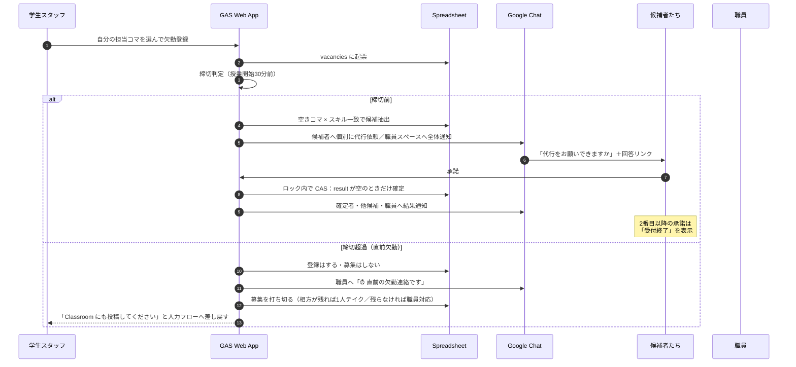
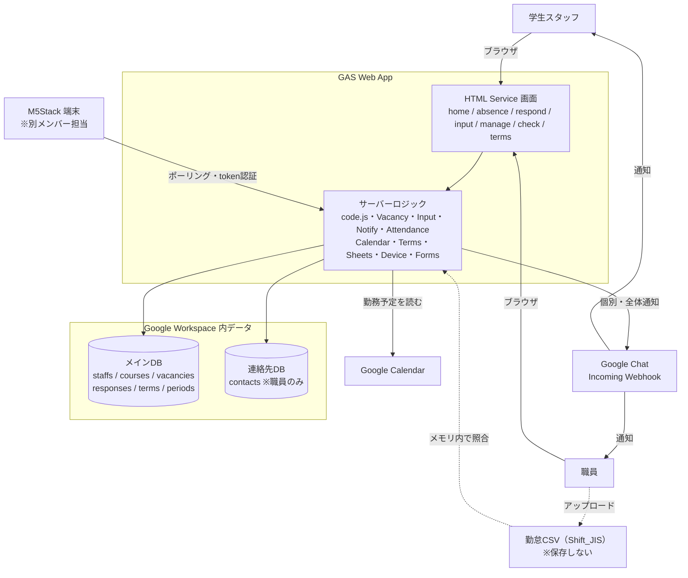
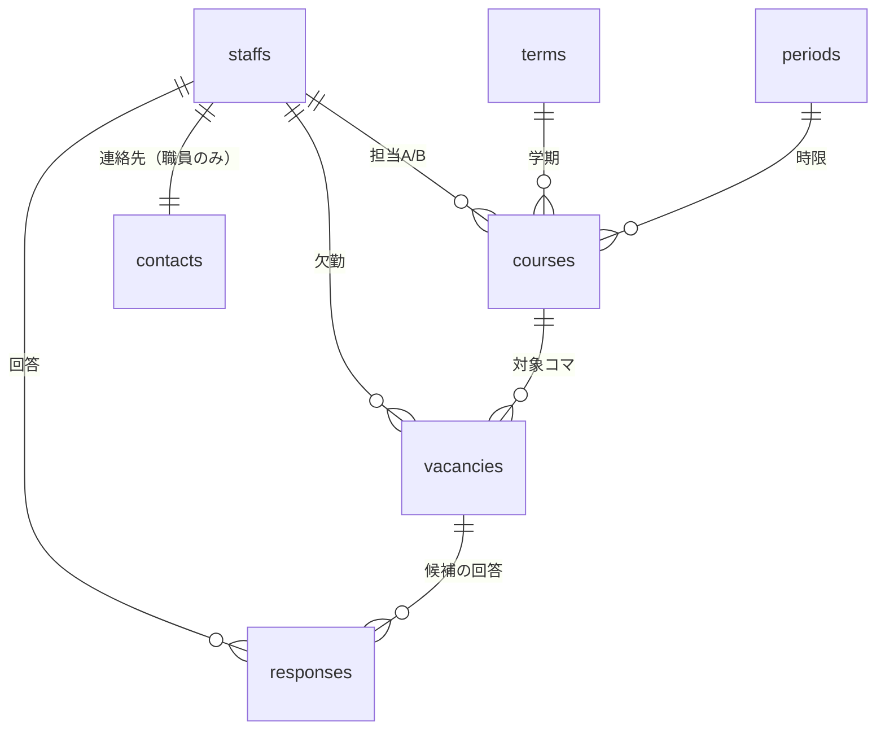

# takeover

> **大学の障がい学生支援室**で、シフトに欠員が出たら代行を自動で募り、
> 最初に承諾した人へ確定させる業務システム。
> ノートテイクの「テイク」と、代行が引き継ぐ "take over" から。

学生スタッフ（ノートテイカー・移動/介助スタッフ）のシフトを時間割としてアプリ内に常設し、
欠員が出たら **候補を自動抽出 → Google Chat で代行依頼 → 最初に承諾した人へ先着で自動確定** するところまでを一気通貫で行う。
これが本来の目的（**機能A**）で、要件ヒアリングの過程で見つかったもう一つの手作業
—— **勤怠データとカレンダーの突き合わせ** の自動照合（**機能B**）—— を後から加えている。

| | |
|---|---|
| **技術** | Google Apps Script / HTML Service / Spreadsheet / Google Chat Webhook |
| **データ** | すべて大学 Google Workspace 内に完結（外部DB・外部サービスへ個人情報を出さない） |
| **規模** | 約 7,100 行（`src/`）・スクリプト12ファイル＋画面7つ・コミット 88 |
| **期間** | 2026-06 〜 開発中（本番投入目標：2026-09-17 授業開始日） |
| **体制** | 機能A・機能Bを1人で担当（要件定義・設計・実装・ドキュメント・職員向けマニュアル）。実装は Claude Code を併用。**M5Stack 端末は別メンバー担当**（本書では範囲外） |

---

## なぜ作ったか

**私自身がこの支援室の学生スタッフ（ノートテイカー）です。** 要件は支援室と話しながら固めましたが、
資料を読んで課題を理解したわけではなく、**自分が働きながら「毎回これで詰まっている」と感じていた欠員補充**が
そのまま出発点になっています。現場の言葉が最初から手元にある状態で設計できたのが、このプロジェクトの前提です。

### 本題：欠員が出ても、誰にも届かない

<table>
<tr><th align="left">Before</th><th align="left">After</th></tr>
<tr valign="top"><td>

1. 学生が Google Classroom に欠勤を投稿
2. **バナー通知に本文が出ず、イベント投稿に埋もれる**
3. 職員が気づいた時点で、人材プールの表を**目視でスクリーニング**
4. 候補者へ**個別に電話**
5. 全員断ったら 1人テイク or 職員が対応

</td><td>

1. 学生が画面から欠勤登録
2. その曜日・時限に**空きがありスキルも合う人**を自動抽出
3. 候補者の **Chat 個人スペースへ一斉に代行依頼**
4. **最初に承諾した人へ先着で自動確定**（職員は介在しない）
5. 候補0人・締切超過なら**募集を打ち切り、職員へ引き継ぐ**

</td></tr>
</table>

Classroom は生徒ロールの投稿が他の学生へ全体通知されないため、臨時スタッフを募集しても
「学生が自分で見に行かないと気づけない」Pull 型でした。**Push で確実に届けること**が出発点です。

### あとから加わった課題：勤怠の照合が全部、目視

このプロジェクトは**欠員補充（機能A）を作るために始まりました**。ただ、職員への要件ヒアリングを
重ねるうちに、隣にあるもう一つの手作業が自然と話題に上がります。

学生の勤怠登録（大学の労務管理システム）は記入ミス・登録漏れが多く、職員と教務課が
Google カレンダーの勤務予定と**目視で突き合わせて**承認していました。
機能Aで「シフトと担当者の情報」をすでにデータとして持つことになるうえ、
イレギュラー（超過・早退・休講・代行）の発生源も欠員補充と同じ —— つまり**土台が重なっている**。
そこで、当初のスコープ外だった照合の自動化（**機能B**）も作ることになりました。

→ CSV をアップロードすると、**登録漏れ / 予定外勤務 / 時間不一致**を自動でハイライトする —— という設計で
実装を進めていますが、**機能B はまだ未完成**です（残っている課題は[実装状況](#実装状況)に具体的に挙げています）。

> 目の前の依頼だけを実装して終わらせるのではなく、**ヒアリングで出てきた隣接課題を拾ってスコープに入れた**
> というのが、このプロジェクトの実際の進み方です。以降の記述も、機能Aを主・機能Bを従として構成しています。

---

## 動くところ

### 欠勤連絡から確定まで



### 画面

| 画面 | URL | 対象 | 概要 |
|---|---|---|---|
| シフト確認（時間割） | `?page=home` | 全員 | 利用学生中心の時間割。PC＝曜日×時限グリッド／スマホ＝曜日タブ＋カード。空き枠を緑、欠員対応中を赤で区別。**マイビュー**で自分の担当と「自分が入れる募集中」を見比べ |
| 欠勤連絡 | `?page=absence` | 学生 | 担当コマを選んで欠勤登録 → 候補抽出 → Chat 通知まで自動 |
| 代行依頼への回答 | `?page=respond` | 候補者 | 通知リンク専用。承諾／辞退。先着で自動確定 |
| シフト入力 | `?page=input` | 職員 | 時間割の追加・編集・削除。担当欄は**その枠に入れる人だけ**を自動表示 |
| 欠員補充管理 | `?page=manage` | 職員 | 欠員一覧・回答状況・候補の電話番号（電話フォローを画面内で完結） |
| 整合性チェック | `?page=check` | 職員 | 勤怠CSVをアップロード → カレンダーと自動照合 → 差分ハイライト |
| 学期設定 | `?page=terms` | 職員 | 年度の学期を追加・開始/終了日を編集（スプレッドシートを直接触らせない） |
| 端末エンドポイント | `?device=alert` | M5Stack | 未対応欠員の**件数と最新番号のみ**返す（個人情報なし）。※端末側は別メンバー担当 |

---

## アーキテクチャ



> 📐 データフロー・通知シーケンス・ER図・権限設計の詳細は **[`docs/spec/architecture.md`](docs/spec/architecture.md)**。

---

## 技術的に難しかったところ

<details open>
<summary><b>① 先着自動確定の競合制御 — 「同時に押される」を前提に組む</b></summary>

代行者を職員が選ぶのをやめ、**最初に承諾した人へ自動確定**する方式にしました（[D1](docs/spec/decisions.md)）。
最速で枠が埋まる代わりに、**複数の候補が同時に「承諾」を押す**ケースが常に起こり得ます。

- `LockService` で確定処理を直列化し、その内側で **CAS（compare-and-set）** を行う
  → `claimIfEmpty()` が「`result` が**空のときだけ** `補充済` と代行者IDを書く」を1操作として実行
- 読んでから書くまでの間に他の承諾が割り込んでも、**先約を上書きしない**
- 2番目以降の承諾には `{filled: true}` を返し、回答画面は「すでに他の方が代行に決まりました」に切り替えてボタンを無効のままにする

「あとで職員が直せばいい」ではなく、**データが壊れない形にしてから自動化する**という順序を守りました。
</details>

<details>
<summary><b>② 一番混む瞬間に一番遅い、を直す — API往復 19回 → 2回</b></summary>

①を実装したあと計測すると、**「承諾」1タップの経路だけでスプレッドシートを19回開いて19回全読みし、
Chat 通知を3回逐次送信**していました。候補が増えるほど連絡先DBの全読みと HTTP が線形に増える
＝ **競合が起きるまさにその瞬間に最も遅く、ロック待ち15秒に近づく**という最悪の形です。

- **データアクセス層（`Sheets.gs`）に実行内キャッシュを閉じ込めた**。整合性の担保は
  「**ロックを跨いだら必ず捨てる**」の一点に集約し、`withLock_` がロック取得直後と解放直前に破棄する
  → ロック内の読み取り（採番・CAS の現在値検証）は必ず実データを見る／自分の書き込みは次の読み取りに必ず反映される
- 当初案の「各関数に ctx を配る」は**捨てた**。呼び出し側を触らずに全経路へ効き、
  今後追加する関数にも自動で効くほうが、この規模では壊れにくいと判断
- 通知は `UrlFetchApp.fetchAll` で職員スペース・確定者・他候補を**1回に束ねた**。
  不正な Webhook URL は `fetchAll` に渡さず個別に記録し、**1件の不正で全員未達になる**のを防ぐ

**結果**：スプレッドシートを開く回数はどの操作でも **2回（メインDB＋連絡先DB）に固定**。
承諾 19→2、欠勤連絡 21→2、画面表示系 7〜10→2。候補人数に対する線形増加も解消。
</details>

<details>
<summary><b>③ 「現在の学期」が1つに決まらないドメイン</b></summary>

この大学ではクォーター制（先端理工学部のみ・1年4クォーター）とセメスター制（他学部）が
**同じ暦の上で同時に走ります**。前期 ⊇ 1Q+2Q、後期 ⊇ 3Q+4Q の入れ子で、
たとえば **7月は「前期」と「2Q」が両方"現在"**。「最新の学期」という単一の概念が存在しません。

- 当初は学期IDの文字列ソートで最新を取っていたが破綻 → **`terms` シート（開始日・終了日）**を導入し、
  「**今日を含む学期の集合**」を返す方式に変更（[D16](docs/spec/decisions.md)・`Terms.gs`）
- さらに、単純に「今日を含む学期」だけを表示すると、7月時点で**日付上すでに終了した 1Q のコマが消える**。
  時間割の既定表示は「**今日を含むセメスター＋それに内包されるクォーター全体**」に修正（D18）
- 学期の日付は年によって違うのに自動更新の仕組みがない → 放置すると**無言で前年度表示に落ちる**。
  職員が画面から年度追加・日付編集できる「学期設定」を作り、
  画面上部に「本日を含む学期があるか」の状態を出して**フォールバックを可視化**した（D19）

ドメインの二重構造を、コードの分岐ではなく**データ（日付レンジ）で表現**したのがポイントです。
</details>

<details>
<summary><b>④ システムが担えない範囲を、明示的に人へ返す</b></summary>

代行募集には締切が要ります（授業5分前の欠勤に依頼を飛ばしても現実的に間に合わない）。
締切は**授業開始の30分前**に決めました（[D21](docs/spec/decisions.md)）。設計上の判断は3つ。

- **締切を欠員行に保存しない**。`vacancies.date` ＋ `periods.start_time` から毎回算出する。
  保存すると定数を変えたとき既存の欠員が古い締切のまま残り、「この欠員だけ締切が違う」状態が生まれる
- **締切超過でも欠勤登録は必ず受ける**。募集はしないが、職員へは通知する
  （補充が間に合わないケースこそ即座に知る必要がある）。相方が残れば「1人テイク」、
  残らなければ「職員対応」として**募集を打ち切る**
- 学生の画面には「**Classroom にも欠勤の連絡を投稿してください**」と案内する。
  システムが担えない部分を**従来の人力フローへ明示的に差し戻す**

時限マスタの時刻が読めない場合は**締切判定をしない**（＝従来どおり募集する）安全側フォールバック。
「判定できないから止める」ではなく「判定できないから通す」を選んでいます。

#### 設計を1段進める（次の改修・未実装）

現在の実装は、募集を打ち切るときに結果（`1人テイク` / `職員対応`）まで**システムが書き込みます**。
これを、**締切に達したら募集をクローズするだけにして、結果は空のまま職員へ渡す**形に変える予定です。

| | システムの責務 | 職員の責務 |
|---|---|---|
| 現在 | 募集クローズ ＋ **結果の書き込み** | 必要なら結果を上書き |
| 次の改修 | 募集クローズ **のみ** | **決着（1人テイク／職員対応の判断）** |

理由は、**システムに決められないことを、決めたように記録してしまっている**からです。
「相方が残るから1人テイク」はあくまで機械的な推定で、実際には職員が入るべき日かもしれない。
それを `result` に書いてしまうと、**未対応の欠員が「対応済み」に見えて一覧から消えます**。
最も人手を要する欠員が、最も見えなくなるという逆転が起きる。

「募集は自動で閉じる（時間で決まるので機械にできる）／決着は人が決める（人員配置の判断なので機械にできない）」
という線引きに揃えるのが、この改修の狙いです。実装には締切到達を検知する**時間トリガー基盤**が必要で、
締切前リマインドとセットで進めます。
</details>

<details>
<summary><b>⑤ 個人情報を「持たない・見せない・残さない」</b></summary>

被支援者の氏名とスタッフの連絡先を扱うため、権限設計は最初に固めました（D3・D4、本部確認済み）。

- **スプレッドシートを2つに分離**。連絡先（電話・Webhook URL）は**職員のみアクセス可**の別ファイル
- Web App を「**職員として実行**」でデプロイ → 学生は**どのスプレッドシートにも権限ゼロ**。
  渡すのは学内ドメイン限定の URL のみ。**データ保護の責任は全部コードの role 判定に載る**ので、
  職員専用処理は `requireStaff_()` を通す規約にした
- 勤怠CSVは**シートにもドライブにも保存しない**。base64 で受け取り → `Shift_JIS` 復号 →
  **メモリ内で照合して結果だけ画面に返す**。CSV には他キャンパス・職員・別バイトの行も混ざるため、
  `個人ｺｰﾄﾞ` が名簿にあり かつ アルバイト先が `ノートテイク` の行だけ残して**即破棄**する
- M5Stack 端末（別メンバー担当）へ返すのは、トークンで保護したうえで**件数と最新番号だけ**という取り決めにした
- フォーム連携は**メールをキーに名簿と照合**し、登録済みスタッフの行だけ更新（学外ユーザーの混入防止）

</details>

<details>
<summary><b>⑥ 業務ルールをそのまま比較に落とせない照合</b></summary>

勤怠照合は「カレンダーとCSVを分単位で比べる」では**全部が差分になります**。出勤簿には運用ルールがあるからです。

- 授業が早く終わっても、**元々勤務予定だった時間分**を出勤簿に入力する
- 支払いは**15分単位**。5分遅刻なら予定時間 −15分、10分延長なら +15分
- CSVは「**実際に働いた日だけ**」出力される＝陽性記録のみ。欠勤・休講の日は**行が存在しない**

そこで、職員がイレギュラーを反映済みのカレンダーを「予定の正」とし、**15分丸めで比較**。
突合キーは予定側が `カレンダー説明欄の氏名 → staffs.name`、実績側が `CSVの個人ｺｰﾄﾞ → staffs.personal_code`
（氏名照合は同姓同名・表記ゆれで事故るため実績側では使わない）。差分は3型に整理しました。

| | 状態 | 意味 |
|---|---|---|
| 🔴 登録漏れ | 予定あり・CSV無し | 学生の登録漏れ／欠勤・休講。**最重要** |
| 🟡 予定外勤務 | CSVあり・予定無し | 代行で入った・超過枠など |
| 🟠 時間不一致 | 両方あり・15分丸めでズレ | 超過・早退 |

**自動では正誤を判定しません**。ズレは提示するが、承認するのは人。突合できなかった行（氏名の表記ゆれ・
未登録の個人コード）も差分とは別枠で「要確認」として全部出します。

> ⚠️ **ここは設計の話で、機能B はまだ未完成です。** 実データを前提にした部分（休憩時間の扱い、
> カレンダー説明欄のパース、CSVの列構成）が未検証のまま残っています。詳細は[実装状況](#実装状況)。
</details>

<details>
<summary><b>⑦ コピペ由来のバグを、構造で潰す</b></summary>

画面が7つに増えた時点で、ヘッダー・ナビ・CSS を**各HTMLがコピーして持っている**状態になり、
実際にナビの内容がズレていました（学期設定を追加したとき、3画面にしかリンクを足していなかった）。
画面を足すたび7ファイルへ手で追記する構造では、抜け漏れが再発し続けます。

- ナビを**画面定義（`PAGES`）から導出**し、サーバー側の `renderChrome_()` がヘッダー＋ナビを組み立てる。
  各HTMLは `<?!= chrome ?>` を1行貼るだけ
- 権限による出し分けは **`doGet` のアクセス制御と同じ判定**を使う（表示と制御が二重管理にならない）
- 色・余白・角丸は `shared-styles.html` の CSS 変数に集約。全体の見た目は `:root` だけで変わる
- 学生はスマホ中心・職員はPC中心という**利用実態に合わせて**ナビの形（大ボタン／横スクロールのピル）を出し分け

**結果**：426行削除 / 314行追加。画面を1つ足せば全画面のナビに自動で載り、権限の出し分けも自動で効く。
</details>

---

## 設計上の制約と、その中での選択

| 制約 | 選択 | 理由 |
|---|---|---|
| 外部DB（Firebase・Supabase等）**使用不可**。データは大学 Google Workspace 内に完結 | Spreadsheet をDBとして使う | セキュリティポリシー上の要件。副次的に**職員が中身を直接確認・修正できる**利点もある |
| サーバーを立てられない・運用担当がいない | **GAS Web App** | ホスティング・SSL・認証が最初から付いてくる。大学アカウントでのログインが自動 |
| Gmail は埋もれる／Classroom は生徒投稿が全体通知されない | **Google Chat の個人スペース Webhook** | Chat API の Bot 権限を取らずに**個別に Push**できる |
| GAS の実行時間制限 **6分/回** | 重い処理を分割・往復を削減（②） | 通知の非同期化は時間トリガー基盤とセットで Phase 2 |
| クラウドから LAN 内の端末へ push できない | M5Stack が **GAS を定期ポーリング**（端末は別メンバー担当） | 端末側で「確認した」状態を持てば、GASは読み取り専用で済む |
| 職員に開発知識がない・**開発者がいなくなっても運用が続く** | 設定はすべて画面から（学期・シフト・名簿）。職員向けマニュアルを同梱 | スプレッドシートを直接触らせない方針（D3/D4/D19） |

---

## データモデル



`courses` は「**利用学生（被支援者）中心の時間割**」で、1行＝1コマ（利用学生×曜日×時限）。
同じ枠に複数の利用学生が並び、テイクはスタッフ2名、介助は1名（`staff_b_id` が空）です。
`staffs.available_slots`（`月1,火3` 形式）と `staffs.skills`（`テイク`/`介助`）の突き合わせが候補抽出の中核。

> 各シートの全カラムは [`CLAUDE.md`](CLAUDE.md) と [`docs/spec/requirements.md`](docs/spec/requirements.md) にあります。

---

## 実装状況

| | 機能 | 状態 |
|---|---|---|
| A | 欠勤登録・候補自動抽出（空きコマ×スキル） | ✅ |
| A | Google Chat 個別通知・職員スペース全体通知 | ✅ |
| A | 先着自動確定（Lock + CAS）・候補0人での募集打ち切り・再オープン | ✅ |
| A | 代行募集の締切（授業開始30分前）・直前欠勤の扱い | ✅ |
| A | 欠員補充管理（一覧・回答状況・候補の電話番号） | ✅ |
| A | 締切前リマインド・締切到達時のエスカレーション | ⏳ 時間トリガー基盤が必要 |
| A | **決着を職員に返す**（締切で募集クローズのみ・結果は書かない） | ⏳ 設計変更を予定（上記④） |
| A | 代行確定の Google カレンダー自動反映 | ⏳ 当面は人手運用 |
| B | 勤怠CSV照合エンジン（Shift_JIS・15分丸め・差分3型） | 🚧 **未完成** |
| B | 整合性チェック画面（アップロード・期間指定・ハイライト） | 🚧 **未完成** |
| B | 実CSVヘッダー・実カレンダーに対する前提の検証 | ⏳ 実データ待ち |
| B | 月末リマインダー・教務課向けレポート出力 | 📋 Phase 3 |
| 共通 | 利用学生中心の時間割・マイビュー・レスポンシブ | ✅ |
| 共通 | シフト入力（追加・編集・削除／候補絞り込み） | ✅ |
| 共通 | フォーム連携（空きコマ・連絡先の自動取り込み） | ✅ |
| 共通 | 学期マスタ・学期設定画面 | ✅ |
| 別担当 | M5Stack 物理アラート端末（スケッチ・実機） | — 本書の範囲外（別メンバー担当） |

**検証の段階**（正直に書いておきます）：
**機能A は実機テスト完了**（実 GAS・実 LockService・実 Spreadsheet 上で、
先着確定が後着に上書きされないこと・再オープン・候補抽出・締切判定まで確認済み）。
**機能B は未完成**。コードは一通り書いてありますが、**実データに対する前提が検証できておらず、
現時点で正しく動く保証はありません**。分かっている未解決点は次のとおりです。

- **休憩時間を処理していない** —— CSV には `開始 / 終了 / 休憩 / 時間(実労)` があるのに、
  パーサが読んでいるのは開始と終了だけ。休憩を挟む枠は必ずズレる（`Attendance.gs`）
- **カレンダー説明欄の全行を氏名として扱っている** —— `parseEvent_` が空でない行をすべて
  スタッフ名とみなすため、メモが1行でも入っていれば「要確認」に流れ込む。
  実カレンダーの説明欄が氏名だけで構成されているかは未確認
- **CSVのヘッダー文字列とブロック列順が推測のまま** —— `ｱﾙﾊﾞｲﾄ先` の次が開始・その次が終了、
  という固定オフセットを仮定している。実CSVで未確認（コード側もそう注記してある）
- **テストが合成データのみ** —— 上の前提が誤っていても通ってしまう

実勤怠CSVと実カレンダーはどちらも実データのため未入手で、テスト段階に入れていません。

（M5Stack 端末は別メンバー担当のため、開発・テストとも私の実施範囲に含みません。）

---

## 開発プロセス

コードと同じ熱量で、**「なぜそう決めたか」を残す**ことを重視しました。仕様が現場ヒアリングで
何度も反転したため（例：D1 は「職員が最終確定」という当初原則を真逆にした変更）、
決定の背景がないと半年後の自分にも引き継げないからです。

実装には **Claude Code を併用**しています（コミット履歴の `Co-Authored-By` のとおり）。
現場からの要件の聞き取り、ドメイン知識の持ち込み、下記の決定ログはいずれも自分の担当で、
[`CLAUDE.md`](CLAUDE.md) は**その文脈を AI 側に渡すために書いたもの**です。

| ドキュメント | 役割 |
|---|---|
| [`docs/spec/decisions.md`](docs/spec/decisions.md) | **意思決定ログ（22件）**。背景・決定・影響・ステータスを1件ずつ。仕様の根拠を後から追える |
| [`docs/spec/requirements.md`](docs/spec/requirements.md) | 要件定義（As-Is / To-Be フロー図つき） |
| [`docs/spec/architecture.md`](docs/spec/architecture.md) | アーキテクチャ・データフロー・ER図・権限設計 |
| [`docs/spec/backlog.md`](docs/spec/backlog.md) | 未対応の改善点（気づいた時点で全部書く） |
| [`docs/spec/notify-scaling-options.md`](docs/spec/notify-scaling-options.md) | 通知スケール課題の検討案（**採用しなかった案**も残す） |
| [`docs/guides/operations.md`](docs/guides/operations.md) | **職員向け利用マニュアル**（GAS知識不要・URLを受け取った人が読む） |
| [`docs/guides/setup.md`](docs/guides/setup.md) | 構築・引き継ぎ手順（管理者が一度だけ行う） |
| [`docs/history/changelog.md`](docs/history/changelog.md) | 日付ごとの変更履歴 |
| [`docs/history/review-*.md`](docs/history/) | コードレビュー記録（指摘と対応を残す） |
| [`CLAUDE.md`](CLAUDE.md) | AI コーディング支援に渡すプロジェクトコンテキスト（ドメイン知識・データ設計・規約） |

Git は `main`（本番）/ `dev`（開発）の2本運用、機能追加は `feature/xxx` から PR。

---

## ディレクトリ構成

```
src/                  GAS スクリプト（.gs）と画面（.html）※clasp で push
  code.js             エントリポイント（doGet・ルーティング・ロール判定・ヘッダー/ナビ生成）
  Vacancy.gs          欠員起票・候補スクリーニング・先着自動確定・募集の打ち切り・再オープン
  Notify.gs           Google Chat 通知（fetchAll で一括送信）
  Sheets.gs           Spreadsheet 操作の共通処理・CAS・実行内キャッシュ
  Attendance.gs       勤怠整合性チェック（CSV ↔ カレンダー照合エンジン）
  Calendar.gs         カレンダー連携（予定パース・診断）
  Terms.gs            学期マスタ解決（クォーター/セメスター同時進行）
  Input.gs            シフト入力（courses の追加・編集・削除・候補絞り込み）
  Forms.gs            フォーム連携（空きコマ・連絡先をメールキーで自動反映）
  Device.gs           M5Stack 用エンドポイント（端末連携は別メンバー担当）
  Constants.gs        ドメイン定数（状態文字列・締切定数の一元化）
  Setup.js            DB初期化・ダミーデータ生成・マイグレーション
  shared-styles.html  全画面共通のCSS（デザイントークン＋共通パーツ）
  *.html              home / absence / respond / input / manage / check / terms
device/               物理アラート端末（M5Stack）のスケッチと手順 ※別メンバー担当
docs/                 spec=仕様・設計 / guides=手順書 / history=変更履歴・レビュー
```

---

## セットアップ

> ⚠️ このシステムは**特定の大学の Google Workspace 環境を前提**にしており、
> 外部の方がそのまま動かすことはできません（スプレッドシート・カレンダー・Chat スペースが必要）。
> コードと設計を読むためのリポジトリとして公開しています。

GAS への反映は [clasp](https://github.com/google/clasp) で行います（**clasp は 2.4.2 に固定**。3.x は HTML を push できません）。

```bash
npx clasp push --force
```

初回のみ：

1. GAS エディタで `setupSpreadsheets` を実行 → メインDB・連絡先DB を作成（**ダミーデータ入り**）
2. 生成された2つのIDを**スクリプトプロパティ**に登録
   （`SPREADSHEET_ID` / `CONTACTS_SPREADSHEET_ID` ＋ `CALENDAR_ID` / `CHAT_WEBHOOK_URL` / `DEVICE_TOKEN`）
3. 連絡先DB `contacts` の自分の行の `email` を実アドレスに変更してログイン確認
4. 既存DBへ列を足す場合は `migrateCoursesColumns()` / `migrateStaffsColumns()` / `migrateStaffsPersonalCode()` を実行

認証情報はコードに直書きせず `PropertiesService` で管理します（`.clasp.json` はスクリプトIDを含むため Git 管理外）。

---

## プライバシーについて

- このリポジトリに **実データは一切含まれません**。動作確認はすべてダミーデータで行っています
- 実勤怠CSV・時間割PDF・実データを含むスクリーンショットは `.gitignore` で除外しています
  （被支援者・スタッフの氏名を含むため）
- 連絡先DBの設計・共有範囲は大学本部に確認済みです（D3）

---

## ライセンス

大学の業務システムとして個別に開発したもので、そのままの再利用は想定していません。
**設計と実装を読んでいただくために公開しています。**

（大学との権利関係を確認のうえ、オープンソースライセンスの付与を検討中です）
