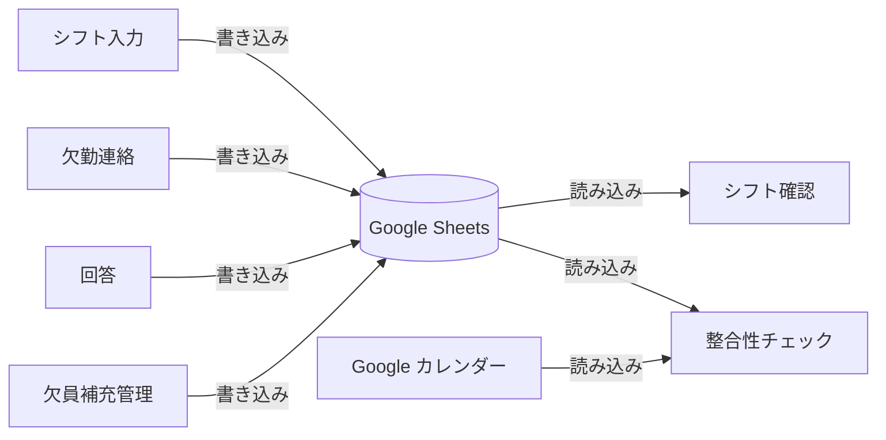
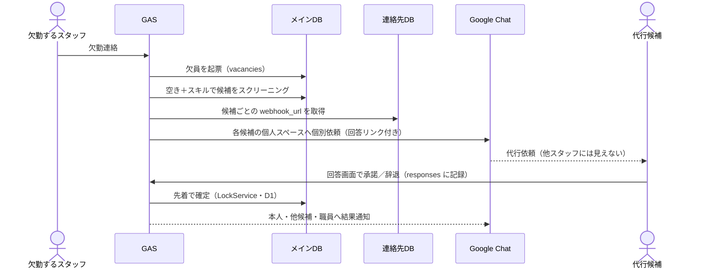

# システムアーキテクチャ設計

**プロジェクト**: 龍谷大学 障がい学生支援室 シフト管理・業務DXシステム
**作成日**: 2026-06-11
**バージョン**: 1.0

---

## 1. 画面一覧

| 画面 | 対象ユーザー | 主な用途 |
|---|---|---|
| シフト入力画面 | 職員（管理者） | クォーター開始時のシフト・スタッフ情報登録 |
| シフト確認画面 | 支援室ユーザー全体 | シフト表・欠員・代行情報の一覧確認 |
| 欠勤連絡画面 | 学生スタッフ | 欠勤の報告 |
| 回答画面 | 学生スタッフ（候補者） | 代行依頼への承諾・辞退の回答 |
| 欠員補充管理画面 | 職員（管理者） | 代行候補の回答状況確認・代行確定 |
| 整合性チェック画面 | 職員（管理者） | カレンダー ↔ 勤怠データの照合 |

---

## 2. アーキテクチャ概要

Google Sheets を中心（Single Source of Truth）に置き、各画面は独立して読み書きする。画面同士は直接通信しない。



> 全体構成（利用者・GAS・外部連携を含む俯瞰図）は [`README.md`](../README.md#-アーキテクチャ) を参照。

---

## 3. 各画面の詳細

### シフト入力画面（職員限定）

- クォーター開始時に職員が操作
- スタッフ情報・担当コマをフォームから入力
- 直接スプレッドシートを編集させない（カスタムUIのみ）
- 書き込み先：メインDB（staffs・courses シート）

### シフト確認画面（全体公開）

- 他の画面の情報を集約して表示するダッシュボード
- シートを読み込むだけで、書き込みは行わない

表示内容：

```
┌──────┬──────┬───────────────────┐
│ 日時  │ 担当  │ 状況               │
├──────┼──────┼───────────────────┤
│ 月1限 │ 山田  │ ✅ 通常            │
│ 月2限 │ 田中  │ ⚠️ 欠員あり        │
│      │ →鈴木 │ ✅ 代行確定         │
│ 火1限 │ 佐藤  │ ✅ 通常            │
└──────┴──────┴───────────────────┘
```

- 読み込み元：メインDB（staffs・courses・vacancies シート）

### 欠勤連絡画面（学生スタッフ）

- 学生スタッフが欠勤を報告する
- 送信後、GASが自動で以下を実行：
  1. vacancies シートに欠員を登録
  2. 人材プールから代行候補をスクリーニング
  3. Google Chat Webhook で候補者に通知送信
- 書き込み先：メインDB（vacancies シート）

### 回答画面（学生スタッフ・候補者）

- 通知メッセージの「回答する」ボタンから開く（URL：`?page=respond&vacancy=<ID>`）
- 開いたユーザーを `Session.getActiveUser()` で特定する。URLに staff_id を含めないため、URLが他人に渡ってもなりすましはできない
- 承諾 / 辞退を選んで送信
- 書き込み先：メインDB（responses シート）

### 欠員補充管理画面（職員限定）

- 欠員ごとの代行候補の回答状況を一覧表示
- 職員が最終的な代行者を確定する
- 確定後、GASが Google カレンダーに自動反映
- 読み込み元：メインDB（vacancies・responses シート）
- 書き込み先：メインDB（vacancies シート）

### 整合性チェック画面（職員限定）

- Google カレンダーの勤務予定と勤怠登録データを照合
- 差分（登録漏れ・時間不一致）をハイライト表示
- 他の画面との情報集約は行わない（独立した機能）
- 読み込み元：Google カレンダー・勤怠データ

---

## 4. データフロー

| 画面 | 読み込み元 | 書き込み先 |
|---|---|---|
| シフト入力画面 | — | メインDB（staffs・courses） |
| シフト確認画面 | メインDB（全シート） | — |
| 欠勤連絡画面 | — | メインDB（vacancies） |
| 回答画面 | メインDB（vacancies） | メインDB（responses） |
| 欠員補充管理画面 | メインDB（vacancies・responses） | メインDB（vacancies） |
| 整合性チェック画面 | Google カレンダー・勤怠データ | — |

---

## 5. スプレッドシート構成

### データ構造（ER図）

`courses` を中心に、利用者中心の時間割（D8）と欠員補充（vacancies/responses）が
`staff_id` / `course_id` / `vacancy_id` で結びつく。`contacts` のみ別ブック（連絡先DB）。

```mermaid
erDiagram
    staffs   ||--o{ courses    : "担当A/B"
    periods  ||--o{ courses    : "時限"
    courses  ||--o{ vacancies  : "欠員対象"
    staffs   ||--o{ vacancies  : "欠勤者/代行者"
    vacancies ||--o{ responses : "回答"
    staffs   ||--o{ responses  : "回答者"
    staffs   ||--|| contacts   : "連絡先(別DB)"

    staffs {
        string staff_id PK
        string name
        string role "職員 / 学生"
        string skills "テイク / 介助"
        string available_slots "月1,火3 …"
    }
    courses {
        string course_id PK
        string quarter
        string day
        string period FK
        string support_type "テイク / 介助"
        string user_student "利用者(被支援者)"
        string subject
        string instructor
        string room
        string staff_a_id FK
        string staff_b_id FK "介助は空"
        string note
    }
    vacancies {
        string vacancy_id PK
        date   date
        string course_id FK
        string absent_staff_id FK
        string notify_status
        string result "補充済/1人テイク/職員対応"
        string substitute_staff_id FK
    }
    responses {
        string vacancy_id FK
        string staff_id FK
        string answer "承諾 / 辞退"
        datetime answered_at
    }
    periods {
        string period PK
        string start_time
        string end_time
    }
    contacts {
        string staff_id PK
        string name
        string email
        string phone
        string webhook_url "秘密・職員のみ"
    }
```



### メインDB（シフト管理）
- アクセス権限：職員 + GASスクリプト
- シート構成：staffs / courses / vacancies / responses / periods（時限マスタ）

### 連絡先DB（個人情報）
- アクセス権限：**職員のみ**
- シート構成：contacts（staff_id・氏名・メール・電話番号・webhook_url）
- GASは通知送信時のみ内部参照。画面には表示しない。
- Webhook URL は「知っていれば誰でも投稿できる」秘密情報のため、連絡先DBに置く。

---

## 6. 通知フロー



> **先着自動確定（D1）**：最初に承諾した候補へ自動で確定する。職員は通常介在せず、
> 誰も承諾しない等の例外時のみ欠員補充管理画面で「1人テイク／職員対応」に決着させる。
> 確定の Google カレンダー反映は今後実装（機能Aの完結・未着手）。

### 個別通知の仕組み（個人スペース + Incoming Webhook 方式）

スタッフ1人につき、本人と職員のみが参加する Chat スペースを1つ作成し、それぞれに Incoming Webhook を発行する。GAS が「その人のスペースの Webhook」に投稿することで、実質的な個別DMとして機能する。Chat API（Bot構築・GCP設定）は不要。

セットアップ手順（クォーター初回・スタッフ入替時のみ）：

1. スタッフごとにスペースを作成（例：「シフト連絡_山田」。メンバーは本人 + 職員）
2. 各スペースで Incoming Webhook を発行
3. URL を連絡先DBの contacts シートに登録

本格導入が決まった場合は Chat API Bot（自動DM）への置き換えを検討する。

---

## 7. 実行権限とアクセス制御

### Web App のデプロイ設定

- **実行ユーザー：「自分（デプロイした職員）」**に設定する。これにより学生スタッフが連絡先DBへの直接アクセス権を持たなくても通知処理が動作する。
- アクセスできるユーザー：大学ドメインのアカウントのみ。

### ロール判定（必須）

「自分として実行」では全ユーザーがスクリプト経由で全データに書き込めてしまうため、職員限定画面はアプリ内でロール判定を行う。

- staffs シートの role 列（職員 / 学生）で判定する
- すべてのリクエストで `Session.getActiveUser().getEmail()` を照合してから処理する

### 同時書き込み対策

複数の候補者が同時に回答する場合があるため、シートへの書き込み処理には `LockService` を必ず使用する。

---

## 8. URL設計

Web App のURLは1本のみ（`/exec`）。`page` パラメータで `doGet` 内で画面を振り分ける。

| URL | 画面 | アクセス制限 |
|---|---|---|
| `?page=home`（既定） | シフト確認画面 | 全体 |
| `?page=input` | シフト入力画面 | 職員のみ |
| `?page=absence` | 欠勤連絡画面 | 全体 |
| `?page=respond&vacancy=<ID>` | 回答画面 | 全体（回答者は自動特定） |
| `?page=manage` | 欠員補充管理画面 | 職員のみ |
| `?page=check` | 整合性チェック画面 | 職員のみ |
