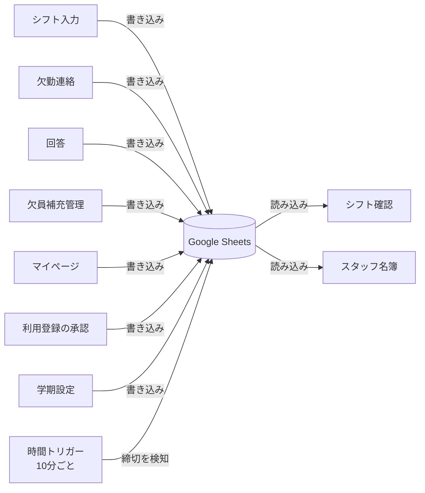
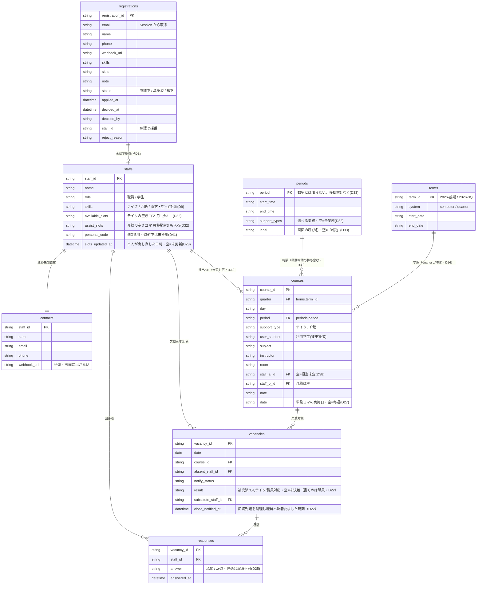
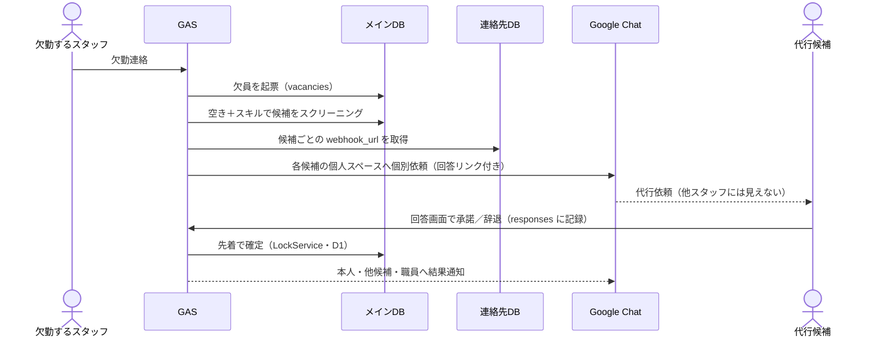

# システムアーキテクチャ設計

**プロジェクト**: 龍谷大学 障がい学生支援室 シフト管理・業務DXシステム
**作成日**: 2026-06-11
**最終更新**: 2026-09-23（実装に合わせて全面改訂・D43）

> この文書が**シート定義と画面構成の正**。実装を変えたらここを直す。
> ただし更新は**設計が固まった区切りごと**に行う（D43）。日々の経緯は
> [`decisions.md`](decisions.md)、未対応は [`backlog.md`](backlog.md) に都度書く。

> ⚠️ **今回のリリースは機能A（欠員補充）だけ。** 機能B（勤怠整合性チェック）は
> `future/feature-b/` へ退避しており、**本番のGASプロジェクトに存在しない**（D41）。
> この文書も機能Aだけを書く。

---

## 1. 画面一覧

| 画面 | `page` | 対象 | 主な用途 |
|---|---|---|---|
| シフト確認（時間割） | `home` | 全体 | 週ごとの時間割・欠員・代行の確認。既定の画面 |
| 欠勤連絡 | `absence` | 学生スタッフ | 自分の担当コマの欠勤を出す |
| シフト入力 | `input` | 職員 | 時間割（コマ）の登録・修正 |
| 欠員補充管理 | `manage` | 職員 | 回答状況の確認・代行確定・決着 |
| スタッフ名簿 | `roster` | 職員 | 登録済みスタッフが**使える状態か**の確認（D30） |
| 利用登録の承認 | `approvals` | 職員 | 名簿に無いアカウントからの申請を承認／却下（D28） |
| 学期設定 | `terms` | 職員 | 年度ごとの学期の開始日・終了日（D19） |
| 代行依頼への回答 | `respond` | 学生スタッフ | 承諾／辞退（通知のリンクから開く） |
| マイページ | `mypage` | 全体 | 本人が連絡先・対応できる業務・空きコマを直す（D28/D31/D32） |
| 利用登録の申請 | `signup` | 未登録者 | **名簿に無いアカウントでも開ける唯一の画面**（D28） |
| USB欠員通知 | `deviceRelay` | 職員 | M5Stack への中継。開きっぱなしにする（ナビには出ない） |

- ナビに出るのは `home` / `absence` / `input` / `manage` / `roster` / `approvals` / `terms`。
  `respond` / `mypage` / `signup` / `deviceRelay` は出さない（`code.js` の `NAV_PAGES`）。
- マイページへは**右上のユーザー名**から入る。ナビの項目を増やさないため。

---

## 2. アーキテクチャ概要

Google Sheets を中心（Single Source of Truth）に置き、各画面は独立して読み書きする。画面同士は直接通信しない。



**シートへのアクセスは必ず `Sheets.gs` を経由する**（`readRows` / `findRow` / `updateRow` /
`claimIfEmpty` 等）。1実行の間だけ読み取りをキャッシュし、整合性は「ロックを跨いだら捨てる」
（`withLock_`）で担保している。直接 `SpreadsheetApp` で書いたら `invalidateSheetCache_()` を呼ぶ。

> 全体構成（利用者・GAS・外部連携を含む俯瞰図）は [`README.md`](../README.md#-アーキテクチャ) を参照。

---

## 3. 各画面の詳細

### シフト入力（職員限定・`input`）

- 学期の初めに、履修登録から確定した時間割（コマ）を登録する
- **担当は未定のままでよい**（D38）。授業は学期開始前に確定するが、担当の割り当ては
  学生の空きコマが集まってから決まる。実務の順番に合わせている
- **介助のコマは、その授業の前後の移動介助も同時に作れる**（D34/D35）。
  既定でオンで、要らなければ外す
- 「この日だけ」を選ぶと単発コマ（特別授業・説明会）になる（D27）
- 直接スプレッドシートを編集させない（カスタムUIのみ）
- 書き込み先：メインDB（courses）

### シフト確認＝時間割（全体公開・`home`）

**表示範囲を決める軸は「見ている週」だけ**（D37）。学期の絞り込みは無い。
遠い週へは週の範囲表示を押してカレンダーから飛ぶ。

```
[◀ 前の週]  [ 9/14(月) 〜 9/20(日) ]  [次の週 ▶]  [今週へ]
                    ↑ 押すとカレンダー

時限        月        火        水        木        金        土
1限       [テイク]  [テイク]  [      ]  [ 介助 ]  [テイク]  [    ]
移動介助   ╌╌╌╌╌╌╌  ╌╌╌╌╌╌╌  ╌╌╌╌╌╌╌  [ 移動 ]  ╌╌╌╌╌╌╌  ╌╌╌╌   ← 細い帯
2限       [テイク]  [      ]  [ 介助 ]  [テイク]  [      ]  [    ]
```

- 週送りは**サーバー往復なし**。コマ・時限・学期は週で変わらないので先に全部渡し、
  週で変わる「欠員の重ね合わせ」だけを `course_id|日付` の索引で渡す（D23）
- 移動介助の枠は**予定が入っている週（スマホはその日）だけ**細い帯として出す（D33/D35）
- 絞り込みは利用者・スタッフ・内容（テイク/介助）と、マイビュー（自分の担当＋入れる募集中）
- 読み込み元：メインDB（staffs・courses・vacancies・periods・terms）

### 欠勤連絡（学生スタッフ・`absence`）

- 学生スタッフが欠勤を報告する。**自分が担当のコマしか出ない**
  （担当未定のコマは誰も出せない＝正しい挙動・D38）
- 送信後、GASが自動で以下を実行：
  1. vacancies シートに欠員を登録
  2. 人材プールから代行候補をスクリーニング
  3. Google Chat Webhook で候補者に通知送信
- 書き込み先：メインDB（vacancies シート）

### 回答画面（学生スタッフ・候補者）

- 通知メッセージの「回答する」ボタンから開く（URL：`?page=respond&vacancy=<ID>`）
- 開いたユーザーを `Session.getActiveUser()` で特定する。URLに staff_id を含めないため、URLが他人に渡ってもなりすましはできない
- 承諾 / 辞退を選んで送信
- 書き込み先：メインDB（responses シート）

### 欠員補充管理（職員限定・`manage`）

- 欠員ごとの回答状況を一覧表示し、職員が決着させる
- **募集クローズ＝システム／決着＝職員**（D22）。締切（授業開始30分前・D21）に達しても
  システムは `result` を書かず、職員へ決着を求める。「1人テイク／職員対応」は人員配置の判断のため
- **辞退した候補の電話番号は出さない**（D25）。誰が反応済みかを見分けるため
- 再オープンは職員のみ（D26）
- 読み込み元：メインDB（vacancies・responses・courses）／連絡先DB（電話番号）
- 書き込み先：メインDB（vacancies）

### スタッフ名簿（職員限定・`roster`）

**読み取り専用**（D30）。名簿に行を作るのは承認だけ、本人の情報を直すのはマイページだけ、
という経路を崩さないため。一覧の主役は「登録されているか」ではなく**使える状態か**。

空きコマ未登録・本人未更新・通知先なし・電話なし・連絡先DBの行が無い、を数で出す。
どれも「登録は済んでいるのに実は動いていない」種類で、放っておくと誰も気づかない。

### マイページ（全体・`mypage`）

本人が直せるのは4つだけ（D28/D31/D32）。`staff_id` は必ず `Session` から取り、
画面から送られた id は見ない。

| 直せる | 直せない |
|---|---|
| `contacts.phone` / `contacts.webhook_url` | `staffs.name`（表示と突合に使う） |
| `staffs.available_slots` / `assist_slots` | `staffs.role`（自分を職員にできてしまう） |
| `staffs.skills`（テイク／介助） | |

- 空きコマは**業務ごとのタブ**で登録する（D32）。テイクと介助で空いている時間が違ううえ、
  介助には時限に収まらない枠（移動介助）が入るため
- **対応できる業務を全部外した保存は弾く**。空欄は「全対応」扱い（D9）なので、
  「どちらもできません」のつもりが逆に全依頼を受ける側に倒れる

### 利用登録の申請・承認（`signup` / `approvals`）

名簿に無いアカウントは `signup` へ回される（**未登録でも開ける唯一の画面**）。
申請は `registrations` に溜まるだけで、**承認するまで `staffs` / `contacts` には一切書かない**（D28）。
`role` は申請者に選ばせず、承認時に職員が決める。

---

## 4. データフロー

| 画面 | 読み込み元 | 書き込み先 |
|---|---|---|
| シフト確認（時間割） | メインDB（courses・staffs・vacancies・periods・terms） | — |
| シフト入力 | メインDB（courses・staffs・periods・terms） | メインDB（courses） |
| 欠勤連絡 | メインDB（courses・periods） | メインDB（vacancies） |
| 代行依頼への回答 | メインDB（vacancies・courses） | メインDB（responses・vacancies） |
| 欠員補充管理 | メインDB（vacancies・responses）／連絡先DB（phone） | メインDB（vacancies） |
| スタッフ名簿 | メインDB（staffs・courses）／連絡先DB（contacts・registrations） | — |
| マイページ | メインDB（staffs・periods）／連絡先DB（contacts） | メインDB（staffs）／連絡先DB（contacts） |
| 利用登録の申請 | 連絡先DB（contacts・registrations） | 連絡先DB（registrations） |
| 利用登録の承認 | 連絡先DB（registrations） | メインDB（staffs）／連絡先DB（contacts・registrations） |
| 学期設定 | メインDB（terms・courses） | メインDB（terms） |
| 時間トリガー（10分ごと） | メインDB（vacancies・courses・periods） | メインDB（vacancies） |

> **連絡先DBを読むのは4か所だけ**（欠員補充管理の電話番号・スタッフ名簿・マイページ・登録まわり）。
> Webhook URL は**どの画面にも出さない**。届くかどうかだけを返す（D30）。

---

## 5. スプレッドシート構成

### データ構造（ER図）

`courses` を中心に、利用学生中心の時間割（D8）と欠員補充（vacancies/responses）が
`staff_id` / `course_id` / `vacancy_id` で結びつく。`contacts` のみ別ブック（連絡先DB）。



### 押さえておくべき決まりごと

ここを外すと**エラーが出ないまま壊れる**。

| 決まり | 外すとどうなるか |
|---|---|
| `periods` の**行の順番が時間割の並び順** | 並べ替えると時間割の並びが崩れる。構築時に確定させ運用では触らない（D40） |
| `periods.period` は**文字列キー**（`移動前3` など） | `assist_slots` に `月移動前3` の形で入る。**改名すると既存の空きコマがどのコマとも一致しない** |
| `skills` 空欄＝**全対応**（D9） | 「どちらもできません」のつもりで空にすると全依頼が飛ぶ |
| `available_slots` は**テイク用**（列名は互換で据え置き・D32） | 介助は `assist_slots`。混同すると片方の業務で候補0人 |
| 空の `staff_a_id` は**担当未定**（D38） | 候補抽出・決着提案・二重起用チェックはいずれも空を除外済み |
| `courses` の過去分は**消さない** | 時間割は終了が1年以上前の学期を送らないことで頭打ちにしている（D37） |

### メインDB（シフト管理）
- アクセス権限：職員 + GASスクリプト
- シート構成：`staffs` / `courses` / `vacancies` / `responses` / `periods` / `terms`

### 連絡先DB（個人情報）
- アクセス権限：**職員のみ**（本部確認済み・D3）
- シート構成：`contacts` / `registrations`
- Webhook URL は「知っていれば誰でも投稿できる」秘密情報のため、連絡先DBに置き、
  **画面にも返さない**（届くかどうかだけを返す・D30）
- `registrations` をここに置くのは、氏名・電話・Webhook を含むため（D28）

> どちらを開くかは `Sheets.gs` の `CONTACTS_DB_SHEETS` が決める。
> シート名を足すときはここにも足す。

---

## 6. 通知フロー



> **先着自動確定（D1）**：最初に承諾した候補へ自動で確定する。職員は通常介在せず、
> 誰も承諾しない等の例外時のみ欠員補充管理画面で「1人テイク／職員対応」に決着させる。
> 確定の Google カレンダー反映は今後実装（機能Aの完結・未着手）。

### 個別通知の仕組み（個人スペース + Incoming Webhook 方式）

スタッフ1人につき、本人と職員のみが参加する Chat スペースを1つ作成し、それぞれに Incoming Webhook を発行する。GAS が「その人のスペースの Webhook」に投稿することで、実質的な個別DMとして機能する。Chat API（Bot構築・GCP設定）は不要。

セットアップ手順（クォーター初回・スタッフ入替時のみ）：

1. スタッフごとにスペースを作成（例：「シフト連絡_山田」。メンバーは本人 + 職員）
2. 各スペースで Incoming Webhook を発行
3. URL を連絡先DBの contacts シートに登録

本格導入が決まった場合は Chat API Bot（自動DM）への置き換えを検討する。

---

## 7. 実行権限とアクセス制御

### Web App のデプロイ設定

- `executeAs: USER_DEPLOYING` ＝ **最後にデプロイした人として動く**。学生スタッフが
  連絡先DBへの直接アクセス権を持たなくても通知処理が動く。
- `access: DOMAIN` ＝ 大学ドメインのアカウントのみ。
- **デプロイしてよいのは「スプレッドシート2つを開ける人」**（D42）。人の属性ではなく成立条件。
  開けない人がデプロイすると全画面が権限エラーで止まる（2026-09-12 に実際に起きた）。
- ⚠️ **引き継ぎ時は職員アカウントで最終デプロイする**。実行アカウントは最後にデプロイした人の
  ままなので、開発者名義のまま抜けると、そのアカウント停止時に止まる（setup.md 6章）。
- ⚠️ **トリガーは別管理**。`installTriggers()` は実行した人のアカウントで動く。
  片方だけ引き継ぐと「画面は動くのに締切通知だけ来ない」という壊れ方をする。

### ロール判定（必須）

「自分として実行」では全ユーザーがスクリプト経由で全データに書き込めてしまうため、職員限定画面はアプリ内でロール判定を行う。

- staffs シートの role 列（職員 / 学生）で判定する
- すべてのリクエストで `Session.getActiveUser().getEmail()` を照合してから処理する

### 同時書き込み対策

複数の候補者が同時に回答する場合があるため、シートへの書き込み処理には `LockService` を必ず使用する。

---

## 8. URL設計

Web App のURLは1本のみ（`/exec`）。`page` パラメータで `doGet` 内で画面を振り分ける。

| URL | 画面 | アクセス制限 |
|---|---|---|
| `?page=home`（既定） | シフト確認（時間割） | 全体 |
| `?page=absence` | 欠勤連絡 | 全体（職員のナビには出さない） |
| `?page=input` | シフト入力 | 職員のみ |
| `?page=manage` | 欠員補充管理 | 職員のみ |
| `?page=roster` | スタッフ名簿 | 職員のみ |
| `?page=approvals` | 利用登録の承認 | 職員のみ |
| `?page=terms` | 学期設定 | 職員のみ |
| `?page=respond&vacancy=<ID>` | 代行依頼への回答 | 全体（回答者は Session で特定） |
| `?page=mypage` | マイページ | 全体（右上のユーザー名から） |
| `?page=signup` | 利用登録の申請 | **名簿に無いアカウントでも開ける** |
| `?page=deviceRelay` | USB欠員通知（M5Stack 中継） | 職員のみ・ナビに出さない |

画面を足すときは `code.js` の `PAGES` に1行足す。ナビに出すなら `NAV_PAGES` にも足す。
それだけで全画面のナビに載り、`staffOnly` の出し分けと現在地ハイライトが効く（D20）。
