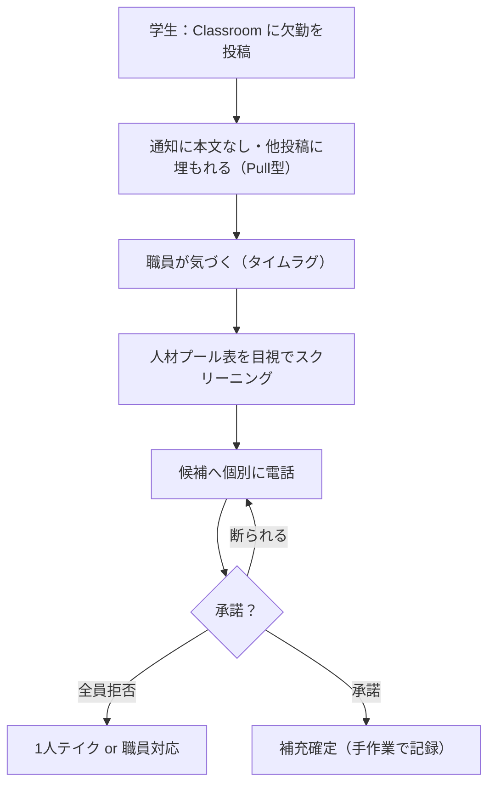
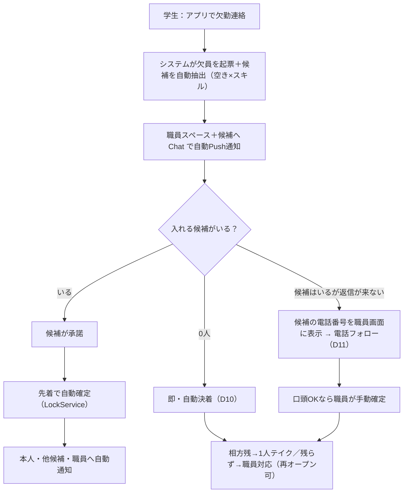
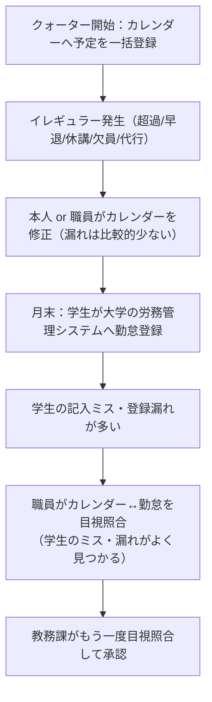
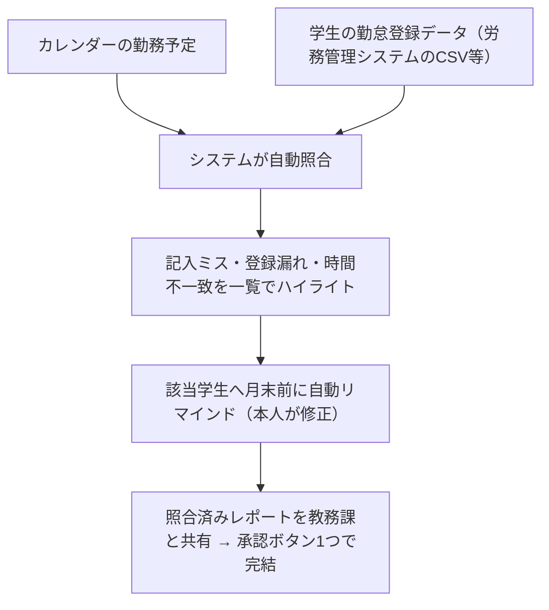

# 要件定義書

**プロジェクト**: 龍谷大学 障がい学生支援室 シフト管理・業務DXシステム
**作成日**: 2026-06-10
**最終更新**: 2026-06-24
**バージョン**: 1.2（Phase 1 / MVP 完了を反映・課題の As-Is/To-Be フロー図を追加）

---

## 1. プロジェクト概要

龍谷大学 障がい学生支援室のアルバイトスタッフ（ノートテイカー）を対象とした、シフト管理・欠員補充自動化・勤怠整合性チェックを行うWebシステム。

| 項目 | 内容 |
|---|---|
| 開発期限 | 2026年9月17日（授業開始日） |
| 実行環境 | GAS Web App（Googleサーバー・サーバー管理不要） |

---

## 2. 解決する課題

### 課題1：欠員補充フローの非効率

| ステップ | 現状の問題点 |
|---|---|
| 欠勤連絡 | Google Classroomへの投稿。バナー通知に本文なし・イベントに埋もれる（Pull型） |
| スクリーニング | 職員が人材プールのスケジュール表を**目視**で確認 |
| 補充依頼 | 職員が候補者に**個別電話** |
| 失敗時 | 全員断った場合、残り1人が単独テイク or 職員が対応 |

**業務原則**: テイク業務は常に2人体制。1人欠員 = 必ず補充アクションが必要。

#### フロー比較（現状 → 導入後）

**現状（As-Is）** … Pull型・目視・個別電話で時間がかかる

**導入後（To-Be）** … Push通知・自動スクリーニング・先着自動確定

### 課題2：勤怠整合性チェックの手作業

| ステップ | 現状の問題点 |
|---|---|
| 予定登録 | クォーター開始時にGoogleカレンダーへ一括登録 |
| イレギュラー対応 | 本人 or 職員がカレンダーを手動修正（修正漏れは比較的少ない） |
| 勤怠登録 | 月末に学生スタッフが大学の労務管理システムへ登録。**記入ミス・登録漏れが多い** |
| 照合 | 職員・教務課が「カレンダー ↔ 勤怠データ」を**目視で突き合わせ**、学生の記入ミス・漏れがここでよく見つかる |

**問題の本質**: 学生の勤怠登録（労務管理システム）に記入ミス・漏れが多く、それを職員・教務課が
カレンダーと**目視照合**して人手で見つけている。照合作業そのものが手作業で重い。

#### フロー比較（現状 → 導入後）

**現状（As-Is）** … 学生の勤怠登録ミス・漏れを、職員・教務課が二重に目視照合で発見

**導入後（To-Be）** … 自動照合で学生の記入ミス・漏れを即検出し本人へリマインド（機能B＝Phase 2 の目標）

> 機能B（勤怠整合性チェック）は照合エンジン（`Attendance.gs`）＋整合性チェック画面（`check.html`）を
> 実装済み（D14）。CSVアップロード→Shift_JIS復号→カレンダーと15分丸め突合し差分3型をハイライトする。
> 月末リマインド（B-3）・教務課レポート共有（B-4）は Phase 3 の残課題。

---

## 3. 機能要件

### 機能A：欠員補充の自動化

| # | 要件 | 優先度 |
|---|---|---|
| A-1 | 欠員情報を職員・スタッフへPush通知で即時伝達 | 必須 |
| A-2 | 人材プールから該当コマの空きスタッフを自動スクリーニング | 必須 |
| A-3 | 候補者へ一括で代行依頼通知を送信（Google Chat Webhook） | 必須 |
| A-4 | 候補者の回答を集約してダッシュボードに表示 | 必須 |
| A-5 | 職員が最終確定操作を行う（システムは自動決定しない） | 必須 |
| A-6 | 代行記録をGoogleカレンダーに自動反映 | 必須 |

### 機能B：勤怠整合性チェックの自動化

| # | 要件 | 優先度 |
|---|---|---|
| B-1 | Googleカレンダーの勤務予定と勤怠登録データを自動照合 | 必須 |
| B-2 | 差分（登録漏れ・時間不一致等）を一覧でハイライト表示 | 必須 |
| B-3 | 月末前にリマインダー通知を自動送信 | 推奨 |
| B-4 | 照合済みレポートを教務課と共有、承認ボタン1つで完結 | 推奨 |

---

## 4. 非機能要件

| 項目 | 要件 |
|---|---|
| 認証 | GAS組み込み認証（大学Googleアカウントで自動SSO） |
| データ保管 | 大学Google Workspace管理下に完結（外部DBは使用不可） |
| 操作性 | 職員が開発者なしで自走できるUI |
| セキュリティ | 認証情報はコードに直書き禁止。PropertiesService で管理 |
| 個人情報 | 外部サービスへの個人情報送信不可 |
| 通知 | Google Chat 専用スペースへ Incoming Webhook で送信。スタッフは通知をオンに設定する運用ルールとする |
| 実行時間 | GASの制限（6分/回）を超える処理は時間起動トリガーで分割 |
| 実証実験 | 本稼働前は仮想データで動作確認を行う |

---

## 5. イレギュラーパターン（業務ドメイン知識）

勤怠照合・欠員補充で考慮すべきイレギュラーの種類：

- 勤務時間の超過
- 授業が予定より早く終了
- 授業の休校
- 欠員が出て予定スタッフが入らなかった
- 別のスタッフが代わりに入った（担当変更）

---

## 6. 制約

- **外部DB禁止**: Firebase・Supabase等は使用不可。データはGoogle Sheetsで管理。
- **サーバー不要**: Docker・Nginx・Node.jsサーバーは使用しない。GAS Web Appで完結。
- **GAS実行時間制限**: 1回の実行は6分以内。重い処理は時間起動トリガーで分割。
- **Gitブランチ運用**: `main`（本番）/ `dev`（開発）/ `feature/xxx`（機能追加）

---

## 7. データ設計

### スプレッドシート構成

個人情報の公開範囲を最小化するため、スプレッドシートを2つに分けて管理する。

| スプレッドシート | 内容 | アクセス権限 |
|---|---|---|
| **メインDB** | シフト管理データ全般 | 職員 + GASスクリプト |
| **連絡先DB** | スタッフの個人連絡先・通知用Webhook URL | **職員のみ** |

GASスクリプトは通知送信時のみ連絡先DBを内部参照する。連絡先情報は画面上には表示しない。

---

### メインDB（シフト管理）

#### `staffs` シート

| カラム | 内容 |
|---|---|
| staff_id | スタッフID |
| name | 氏名 |
| role | 職員 / 学生（画面のアクセス制御に使用） |
| available_slots | 空きコマ。`月1,月2,火3` のカンマ区切り形式（クォーター毎に上書き） |

#### `courses` シート

| カラム | 内容 |
|---|---|
| course_id | コマID |
| quarter | 学期ID（例：2026-3Q / 2026-前期）。月末照合で過去分を参照するため行は削除しない |
| day | 曜日 |
| period | 時限 |
| staff_a_id | 担当スタッフA |
| staff_b_id | 担当スタッフB |

#### `vacancies` シート

| カラム | 内容 |
|---|---|
| vacancy_id | 欠員ID |
| date | 発生日 |
| course_id | 対象コマID |
| absent_staff_id | 欠員スタッフID |
| notify_status | 通知状況 |
| result | 補充済 / 1人テイク / 職員対応 |

#### `responses` シート

候補者ごとの回答を記録する（1欠員に対して候補者の人数分の行ができる）。

| カラム | 内容 |
|---|---|
| vacancy_id | 対象の欠員ID |
| staff_id | 回答した候補者 |
| answer | 承諾 / 辞退 |
| answered_at | 回答日時 |

#### `periods` シート（時限マスタ）

時限と実時刻の変換に使用（カレンダー連携に必須）。

| カラム | 内容 |
|---|---|
| period | 時限（1〜7） |
| start_time | 開始時刻 |
| end_time | 終了時刻 |

---

### 連絡先DB（職員のみアクセス可）

#### `contacts` シート

| カラム | 内容 |
|---|---|
| staff_id | スタッフID（メインDBと紐付け） |
| name | 氏名 |
| email | 大学Googleアカウント |
| phone | 電話番号 |
| webhook_url | 本人専用Chatスペースの Incoming Webhook URL（個別通知用） |

---

## 8. 未決事項（実装前に確認・決定が必要）

| 項目 | 内容 |
|---|---|
| ~~勤怠データの入手経路~~（解決済み・D2） | 大学の労務管理システムから勤怠CSV（Shift_JIS）を出力できることを確認済み。紐付けキーは `個人ｺｰﾄﾞ`、絞り込みは `staffs.personal_code` 在籍 ×`ｱﾙﾊﾞｲﾄ先=ノートテイク`。実データを含むCSVは Git 管理外 |
| 回答締切・全員辞退時の運用（**一部決定・D21**） | **締切＝授業開始30分前**（`RECRUIT_DEADLINE_MIN_BEFORE`）に決定。締切を過ぎた欠勤連絡は「登録のみ受け付け・代行募集なし・職員へ通知・自動決着・学生には Classroom への連絡を案内」で実装済み。**未決**：締切前のリマインドのタイミングと回数／締切到達時の自動エスカレーション（時間トリガー基盤が必要）／夜間・休日の送信可否 |
| 成功指標 | MVP検証で測る指標（欠員発生〜補充確定の所要時間、職員の電話件数など） |
| クラウド利用の可否 | 大学の情報セキュリティポリシー上、スタッフの個人情報をGoogle Workspaceに保存してよいか確認 |

---

## 9. 開発フェーズ

### Phase 1 - MVP（最優先）— ✅ 完了（2026-06-24・コード実装。実機テストは別途）

- [x] GASプロジェクト作成・clasp設定
- [x] Sheetsデータ設計・テンプレート作成
- [x] 欠員登録フォーム（HTML Service）
- [x] 候補者への Google Chat 通知（個人スペース Webhook で個別送信）
- [x] 代行可否の回答画面（responses シートに記録）
- [x] 職員ダッシュボード（欠員一覧・回答状況）
- [x] 先着自動確定（D1）／補充候補0人の自動決着・再オープン（D10）
- [x] 利用学生中心の時間割デジタル化（D8）・マイビュー
- [x] スタッフのスキル区分（D9）／シフト入力画面（input）
- [x] 欠員補充管理に代行候補の電話番号表示・電話フォロー導線（D11）

### Phase 2

- [ ] Google Calendar API連携（代行記録の自動反映）※運用は当面人手（D14）
- [x] 勤怠整合性チェック（カレンダー ↔ 勤怠データ照合）※`Attendance.gs`＋`check.html`（D14）
- [x] 差分ハイライト一覧表示（登録漏れ／予定外勤務／時間不一致）
- [ ] 通知の非同期化・締切リマインド・エスカレーション（時間トリガー基盤・review #5/#7）

### Phase 3

- [ ] 月末リマインダー通知
- [ ] 教務課向け照合レポート出力
- [ ] クォーター更新フロー（スタッフ空きコマ再収集）※入力画面・空きコマ反映は一部対応
